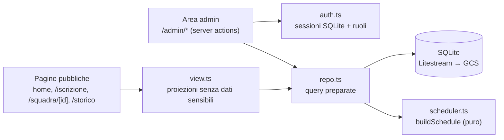

# ABOUTME: Diario tecnico di Geremeas SetPoint: decisioni, bug non banali, lezioni imparate
# ABOUTME: Storytelling tecnico datato e ricercabile, non documentazione asettica

# LEARNING — Geremeas SetPoint

App per un torneo estivo di beach volley: iscrizioni pubbliche, area admin, gironi + tabellone, calendario. Next.js (App Router) + SQLite (better-sqlite3) con Litestream su GCS, deploy su Cloud Run a istanza singola.

## Architettura in una figura

Regola d'oro dei layer: **i dati sensibili dei giocatori (`skill`, `contact`, `age_confirmed`) non escono mai da `repo`/`view` verso una pagina pubblica.** Non si filtra dopo la SELECT: non si legge proprio la colonna.

## Tech Stack & Decisioni

| Scelta | Perché | Trade-off |
|--------|--------|-----------|
| SQLite + Litestream, istanza singola | zero-ops, backup continuo su GCS, costo ~nullo per un torneo di 3 giorni | `--max-instances 1` obbligatorio (due replicatori corrompono la replica); niente scaling orizzontale |
| Sessioni server-side in SQLite (token raw nel cookie, `sha256` sul DB) | la revoca deve essere reale: il logout cancella la riga | stato sul DB (accettato: è l'obiettivo, un JWT stateless non si revoca) |
| Orari come stringhe naive `YYYY-MM-DDTHH:MM` Europe/Rome | confronti lessicali su stringhe zero-padded, niente ambiguità di fuso | **mai** `new Date()` su queste stringhe: su server UTC sposta tutto di 1-2h |
| `buildSchedule` puro (nessun "adesso" dentro) | testabile, deterministico | il "riempi i buchi" a torneo in corso ha bisogno di `nowInRome()`, che vive fuori dallo scheduler (`clock.ts`) |

## Lezioni imparate

### 2026-08-08: un `\n` in un secret ti blocca fuori dal campo

**Contesto.** Deploy del ruolo segnapunti: nuovo secret `geremeas-scorekeeper-pin` su Secret Manager, `--set-secrets SCOREKEEPER_PIN=...`. Login admin ok, login segnapunti "PIN errato".

**Problema.** Avevo creato il secret con `openssl rand -hex 4 > file` e `--data-file=file`. La redirezione `>` lascia il newline finale di `openssl`: il secret conteneva `65f333fc\n` (9 byte). L'app confronta `sha256(pin_inserito)` con `sha256(secret)`, e `sha256("65f333fc") != sha256("65f333fc\n")`. L'admin funzionava perché il suo secret di bootstrap era stato creato con `... | tr -d '\n' | gcloud secrets create ...`.

**Soluzione.** Nuova versione del secret con `printf '65f333fc'` (8 byte, niente newline), poi `gcloud run services update --update-secrets` per rileggerla. Il `deploy/README.md` documentava già il comando giusto: l'errore è stato deviare dalla riga documentata.

**Takeaway.** Quando un confronto crittografico fallisce "senza motivo", sospetta un byte invisibile prima della logica. `xxd` sul valore del secret te lo dice in un colpo. E il `tr -d '\n'` in un comando di bootstrap non è mai cosmetico.

### 2026-08-07: annullare una semifinale lasciava il vincitore in finale

**Contesto.** Bug pre-esistente trovato in review. `clearScore` su una partita di tabellone azzerava il risultato ma non toccava ciò che `propagateKnockout` aveva già scritto a valle.

**Problema.** Annullando una semifinale, il vincitore restava scritto in `team_a`/`team_b` della finale (e il perdente nella finalina 3°/4°, che *esiste* quando `rounds >= 2`, contrariamente all'ipotesi iniziale). Il tabellone mostrava squadre non qualificate.

**Soluzione.** `clearScore` ora calcola l'inverso di `propagateKnockout` (`propagatedDependents`) e azzera SOLO le colonne dei dipendenti che aveva scritto lui, e SOLO se quei dipendenti non hanno ancora un risultato. Se il turno successivo è già stato giocato, l'annullamento è rifiutato con un messaggio esplicito, niente cascata silenziosa. Repro registrato PRIMA del fix: 4 test su 5 rossi.

**Takeaway.** Ogni propagazione ha bisogno del suo inverso esplicito. E la finalina 3°/4° è un secondo canale di propagazione facile da dimenticare: se il codice propaga anche il perdente, il "clear" deve disfare due scritture, non una.

### 2026-08-08: il riposo tra le partite non deve mai costare una partita

**Contesto.** Lo scheduler dava alla stessa squadra due slot consecutivi (zero riposo). Aggiunto il riordino anti back-to-back + un cuscinetto (slot vuoto) quando serve.

**Problema.** Un cuscinetto ingenuo può spingere fuori calendario le ultime partite se non c'è abbastanza spazio. Il riposo non deve MAI trasformarsi in partite non collocate.

**Soluzione.** Doppia passata come rete di sicurezza: se la passata "con riposo" lascia partite fuori, si rigira senza. Ma la garanzia vera sta nel **lookahead esatto** (`ceil(coda/campi)` sommato sul fabbisogno dei blocchi successivi, non un `ceil(totale/campi)` aggregato): con quello, `slot_rimasti − slot_necessari` è invariante rispetto al piazzamento, quindi la passata-1 non perde mai partite e la passata-2 di fatto non si attiva.

**Takeaway.** La rete di sicurezza (doppia passata) è tranquillizzante ma è il lookahead esatto a reggere l'invariante. La cosa fragile è proprio quella: una modifica futura che sbaglia il lookahead romperebbe la garanzia in silenzio, con la doppia passata a nasconderla. Documentato nel codice per questo.

### 2026-08-09: durata partita e pausa sono due concetti distinti

**Contesto.** Il cuscinetto di uno slot trasformava 40 minuti di gioco in inizi
alle 18:00 e 19:20: molto più dei 5 minuti di cambio campo desiderati.

**Soluzione.** La durata configurata resta il tempo di gioco; lo scheduler usa
un intervallo fisso `durata + 5 minuti` e non inserisce più slot vuoti. Il
riempi-buchi calcola la fine stimata dell'ultima partita prima di cercare il
prossimo orario, così resta sicuro anche su calendari creati col vecchio passo.

**Takeaway.** Modellare esplicitamente la pausa evita di usare uno slot intero
come approssimazione: con 40 minuti gli inizi sono 18:00, 18:45, 19:30.

### 2026-08-08: dietro Cloud Run il primo IP di `x-forwarded-for` è dell'attaccante

**Contesto.** Lockout dei login (5 tentativi → 15 min) keyed sull'IP. Preso `x-forwarded-for.split(",")[0]`.

**Problema.** Il proxy di Google *appende* l'IP reale in coda a XFF e non strippa un XFF fornito dal client: il valore più a sinistra è controllato dall'attaccante. Ruotando il primo segmento a ogni richiesta, il lockout non scatta mai. In variante DoS, spoofando l'IP dell'admin lo si blocca fuori.

**Soluzione.** Leggere l'ULTIMO segmento di XFF (quello appeso dall'infrastruttura), non il primo. Fix di una riga.

**Takeaway.** "L'IP del client" dietro un proxy dipende da chi ha scritto quale pezzo di XFF. Su Cloud Run il segmento attendibile è l'ultimo; il leftmost è input non fidato come qualsiasi altro.

## Pitfall & Gotchas

- **Worktree fresco → `tsc` fallisce su `LayoutProps`.** È un tipo generato da Next in `.next/types/**` (incluso da `tsconfig.json`). In un worktree pulito `.next/` non esiste. Fix: `npx next typegen` prima di `make check`. Non è codice rotto, è ambiente mancante.
- **`vitest` raccoglieva lo spec Playwright.** Il default include `**/*.spec.ts`, quindi `e2e/full-flow.spec.ts` finiva in `npm test` e lo rompeva. `vitest.config.mts` esclude `e2e/**`. Rinominare/spostare gli spec e2e con altro suffisso rompe di nuovo `npm test` in modo poco leggibile.
- **Test "il payload non contiene X" tautologico.** Un `not.toContain("skill")` è verde anche su un oggetto vuoto o se `JSON.stringify` mangia le Map. Va falsificato: prima si asserisce che i dati grezzi CONTENGONO davvero "skill"/il telefono, poi che il payload pubblico no. Senza il controllo positivo l'asserzione negativa non dimostra niente.
- **`router.refresh()` non ritorna una promise.** Per evitare refresh sovrapposti nell'auto-refresh, lo stato "in volo" si legge da `useTransition`/`isPending`, non si alza un flag a mano (un refresh istantaneo lo lascerebbe bloccato).
- **Full regenerate del calendario a torneo iniziato.** `generateSchedule` riparte dal primo slot e non conosce l'occupazione per campo: a torneo in corso si usa "Completa calendario" (`fillScheduleGaps`), che parte dopo l'ultimo slot occupato. Il refactor per-campo che renderebbe sicuro anche il full-regenerate è tech-debt (issue #3).

## Best practice emerse

- **REPRODUCE prima del fix.** Il bug del tabellone è stato scritto come test rosso e registrato PRIMA di toccare `repo.ts`. Rende il fix verificabile e impedisce di "fixare" la cosa sbagliata.
- **Scoping in query, non nel codice.** Le pagine pubbliche (`/squadra/[id]`, `/storico`) filtrano torneo attivo/status/finished nella SELECT e leggono solo colonne esplicite. Il dato sensibile non entra nel payload perché non viene letto, non perché viene rimosso dopo.
- **Astrazioni della taglia giusta.** `clock.ts` resta iniettabile con un parametro `Date`; `TeamsByMatch` e `busyBefore` sono stati rimossi quando la pausa fissa ha reso inutile il cuscinetto a slot intero.
- **Verifica in prod ciò che i test non possono.** Il re-login post-rollout (sessioni riscritte, vecchi cookie invalidi) è stato verificato nel browser reale: admin, logout+revoca, scorekeeper con nav ridotta. I test coprono la logica; il browser copre "funziona davvero dopo il deploy".
